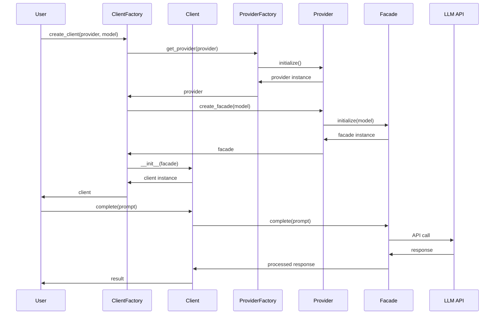

# Software Requirements Specification
## Abhikarta LLM Abstraction System

**Version:** 1.0  
**Date:** November 2025  
**Author:** System Architecture Team  
**Copyright:** © 2025-2030 All rights reserved Ashutosh Sinha  
**Contact:** ajsinha@gmail.com  
**Repository:** https://www.github.com/ajsinha/abhikarta  

---

## Table of Contents

1. [Executive Summary](#executive-summary)
2. [System Overview](#system-overview)
3. [Architectural Requirements](#architectural-requirements)
4. [Functional Requirements](#functional-requirements)
5. [Non-Functional Requirements](#non-functional-requirements)
6. [System Architecture](#system-architecture)
7. [Component Specifications](#component-specifications)
8. [Configuration Management](#configuration-management)
9. [Security Requirements](#security-requirements)
10. [Performance Requirements](#performance-requirements)
11. [Testing Requirements](#testing-requirements)
12. [Deployment Requirements](#deployment-requirements)

---

## 1. Executive Summary

### 1.1 Purpose
The Abhikarta LLM Abstraction System provides a unified, configuration-driven interface for interacting with multiple Large Language Model providers. This system abstracts the complexity of different LLM APIs while providing a consistent, extensible, and maintainable architecture.

### 1.2 Scope
This system encompasses:
- Multi-provider LLM support (Meta, Anthropic, Google, HuggingFace, OpenAI, AWS Bedrock, etc.)
- Plugin-based architecture for extensibility
- Configuration-driven model selection and provider management
- Comprehensive interaction history management
- Robust error handling and fallback mechanisms
- Mock provider for testing and development

### 1.3 Key Benefits
- **Provider Agnostic**: Seamless switching between LLM providers
- **Configuration-Driven**: No code changes required for provider/model updates
- **Extensible**: Plugin architecture allows easy addition of new providers
- **Secure**: API keys managed through environment variables or properties files
- **Testable**: Built-in mock provider for testing
- **Maintainable**: Clear separation of concerns with well-defined abstractions

---

## 2. System Overview

### 2.1 High-Level Architecture

```
┌─────────────────────────────────────────────────────────────┐
│                     Application Layer                        │
│                    (User Applications)                       │
└────────────────────────┬────────────────────────────────────┘
                         │
┌────────────────────────┴────────────────────────────────────┐
│                    LLM Client Layer                          │
│         (LLMClient, LLMClientFactory, History)               │
└────────────────────────┬────────────────────────────────────┘
                         │
┌────────────────────────┴────────────────────────────────────┐
│                    Facade Layer                              │
│              (LLMFacade Implementations)                     │
└────────────────────────┬────────────────────────────────────┘
                         │
┌────────────────────────┴────────────────────────────────────┐
│                   Provider Layer                             │
│            (LLMProvider Implementations)                     │
└────────────────────────┬────────────────────────────────────┘
                         │
┌────────────────────────┴────────────────────────────────────┐
│                 Configuration Layer                          │
│      (JSON Config, Properties, Environment Variables)        │
└──────────────────────────────────────────────────────────────┘
```

### 2.2 Module Structure

```
llm/
├── abstraction/
│   ├── __init__.py
│   ├── core/
│   │   ├── __init__.py
│   │   ├── provider.py         # Abstract LLMProvider
│   │   ├── facade.py           # Abstract LLMFacade
│   │   ├── client.py           # LLMClient
│   │   ├── factories.py        # Factory classes
│   │   ├── history.py          # Interaction history management
│   │   └── exceptions.py       # Custom exceptions
│   │
│   ├── providers/
│   │   ├── __init__.py
│   │   ├── anthropic/
│   │   │   ├── __init__.py
│   │   │   ├── provider.py
│   │   │   └── facade.py
│   │   ├── openai/
│   │   │   ├── __init__.py
│   │   │   ├── provider.py
│   │   │   └── facade.py
│   │   ├── google/
│   │   │   ├── __init__.py
│   │   │   ├── provider.py
│   │   │   └── facade.py
│   │   ├── meta/
│   │   │   ├── __init__.py
│   │   │   ├── provider.py
│   │   │   └── facade.py
│   │   ├── huggingface/
│   │   │   ├── __init__.py
│   │   │   ├── provider.py
│   │   │   └── facade.py
│   │   ├── awsbedrock/
│   │   │   ├── __init__.py
│   │   │   ├── provider.py
│   │   │   └── facade.py
│   │   └── mock/
│   │       ├── __init__.py
│   │       ├── provider.py
│   │       └── facade.py
│   │
│   ├── config/
│   │   ├── __init__.py
│   │   ├── configurator.py     # Configuration manager
│   │   ├── validators.py       # Configuration validators
│   │   └── loader.py           # Dynamic module loader
│   │
│   ├── utils/
│   │   ├── __init__.py
│   │   ├── retry.py           # Retry mechanisms
│   │   ├── rate_limiter.py    # Rate limiting
│   │   ├── logger.py          # Logging utilities
│   │   └── validators.py      # Input validators
│   │
│   └── examples/
│       ├── __init__.py
│       ├── basic_usage.py
│       ├── multi_provider.py
│       ├── history_usage.py
│       └── advanced_features.py
│
├── config/
│   ├── llm_config.json        # Main configuration
│   ├── providers/             # Provider-specific configs
│   │   ├── anthropic.json
│   │   ├── openai.json
│   │   ├── google.json
│   │   ├── meta.json
│   │   ├── huggingface.json
│   │   └── awsbedrock.json
│   └── llm.properties         # API keys and settings
│
└── tests/
    ├── unit/
    ├── integration/
    └── fixtures/
```

---

## 3. Architectural Requirements

### 3.1 Design Patterns

#### 3.1.1 Factory Pattern
- **LLMProviderFactory**: Singleton factory for creating LLMProvider instances
- **LLMClientFactory**: Singleton factory for creating LLMClient instances
- Dynamic instantiation based on configuration

#### 3.1.2 Singleton Pattern
- Factory classes must be singletons to ensure centralized instance management
- Thread-safe implementation required

#### 3.1.3 Facade Pattern
- **LLMFacade**: Provides simplified interface to complex LLM operations
- Hides provider-specific implementation details
- Ensures consistent API across different providers

#### 3.1.4 Delegate Pattern
- LLMClient delegates actual LLM operations to LLMFacade
- Separation of client concerns from provider operations

#### 3.1.5 Plugin Architecture
- Providers and facades loaded dynamically based on configuration
- New providers can be added without modifying core code
- Module paths specified in configuration files

### 3.2 Core Abstractions

#### 3.2.1 LLMProvider (Abstract)
```python
class LLMProvider(ABC):
    @abstractmethod
    def initialize(self, config: Dict[str, Any]) -> None:
        """Initialize provider with configuration"""
        pass
    
    @abstractmethod
    def create_facade(self, model_name: str) -> LLMFacade:
        """Create facade for specific model"""
        pass
    
    @abstractmethod
    def list_available_models(self) -> List[str]:
        """List all available models"""
        pass
    
    @abstractmethod
    def validate_credentials(self) -> bool:
        """Validate API credentials"""
        pass
```

#### 3.2.2 LLMFacade (Abstract)
```python
class LLMFacade(ABC):
    @abstractmethod
    def complete(self, prompt: str, **kwargs) -> CompletionResponse:
        """Generate completion for prompt"""
        pass
    
    @abstractmethod
    def chat(self, messages: List[Message], **kwargs) -> ChatResponse:
        """Generate chat response"""
        pass
    
    @abstractmethod
    def stream_complete(self, prompt: str, **kwargs) -> Iterator[str]:
        """Stream completion tokens"""
        pass
    
    @abstractmethod
    def get_model_info(self) -> ModelInfo:
        """Get model information"""
        pass
```

---

## 4. Functional Requirements

### 4.1 Provider Management

#### FR-4.1.1: Multi-Provider Support
- System SHALL support at minimum: Meta, Anthropic, Google, HuggingFace, OpenAI, AWS Bedrock
- System SHALL allow dynamic addition of new providers via configuration

#### FR-4.1.2: Provider Factory
- LLMProviderFactory SHALL be a singleton class
- Factory SHALL instantiate providers based on configuration
- Factory SHALL cache provider instances for reuse

#### FR-4.1.3: Model Management
- Each provider SHALL expose available models
- Model capabilities SHALL be defined in configuration
- System SHALL validate model availability before use

### 4.2 Client Operations

#### FR-4.2.1: Client Creation
- LLMClientFactory SHALL create clients with specified or default provider/model
- Client SHALL maintain reference to LLMFacade instance
- Client SHALL provide high-level convenience methods

#### FR-4.2.2: Core Operations
- Text completion with parameters (temperature, max_tokens, etc.)
- Chat-based interactions with message history
- Streaming responses for real-time output
- Batch processing for multiple prompts
- Token counting and cost estimation

#### FR-4.2.3: History Management
- Client SHALL maintain interaction history
- Default history size: 50 interactions (configurable)
- History SHALL be queryable and exportable
- Support for multi-shot prompt construction from history

### 4.3 Configuration Management

#### FR-4.3.1: Configuration Sources
- JSON files for provider and model specifications
- Properties files for API keys and settings
- Environment variables override properties
- Command-line arguments override all

#### FR-4.3.2: Dynamic Configuration
- Configuration SHALL be reloadable without restart
- Provider modules SHALL be dynamically loadable
- Configuration validation before application

### 4.4 Error Handling

#### FR-4.4.1: Fallback Mechanisms
- Default provider/model fallback
- Mock provider as ultimate fallback
- Graceful degradation on provider failure

#### FR-4.4.2: Retry Logic
- Configurable retry attempts
- Exponential backoff strategies
- Circuit breaker pattern for failing providers

---

## 5. Non-Functional Requirements

### 5.1 Performance

#### NFR-5.1.1: Response Time
- Provider initialization: < 2 seconds
- Client creation: < 100ms
- Configuration loading: < 500ms

#### NFR-5.1.2: Concurrency
- Support for concurrent client operations
- Thread-safe factory implementations
- Connection pooling per provider

### 5.2 Scalability

#### NFR-5.2.1: Provider Scalability
- Support for 50+ providers without performance degradation
- Lazy loading of provider modules

#### NFR-5.2.2: Client Scalability
- Support for 1000+ concurrent clients
- Efficient memory management for history

### 5.3 Security

#### NFR-5.3.1: Credential Management
- API keys NEVER stored in code
- Encrypted storage for sensitive configuration
- Secure credential rotation support

#### NFR-5.3.2: Data Protection
- Sanitization of logs to remove sensitive data
- Optional encryption for interaction history
- Compliance with data privacy regulations

### 5.4 Reliability

#### NFR-5.4.1: Availability
- 99.9% uptime for core functionality
- Graceful handling of provider outages
- Health check mechanisms

#### NFR-5.4.2: Fault Tolerance
- Automatic failover to alternative providers
- Transaction-safe operations
- Data consistency guarantees

### 5.5 Maintainability

#### NFR-5.5.1: Code Quality
- 90%+ test coverage
- Comprehensive documentation
- Type hints for all public APIs

#### NFR-5.5.2: Extensibility
- Plugin architecture for new providers
- Minimal code changes for new features
- Backward compatibility maintenance

---

## 6. System Architecture

### 6.1 Component Interactions



### 6.2 Data Flow

1. **Configuration Loading**
   - Properties file → PropertiesConfigurator
   - JSON configs → ConfigurationManager
   - Environment variables → Override properties
   - Command-line args → Override all

2. **Provider Initialization**
   - Configuration validation
   - Credential verification
   - Model availability check
   - Facade creation

3. **Client Operations**
   - Request validation
   - History management
   - Facade delegation
   - Response processing
   - Error handling

### 6.3 State Management

#### 6.3.1 Singleton State
- Factory instances maintain provider cache
- Configuration state centrally managed
- Connection pools per provider

#### 6.3.2 Client State
- Individual history per client
- Session management
- Rate limiting counters

---

## 7. Component Specifications

### 7.1 LLMProvider Implementations

Each provider implementation must:
1. Inherit from abstract LLMProvider
2. Implement all abstract methods
3. Handle provider-specific authentication
4. Manage rate limiting
5. Provide error mapping

### 7.2 LLMFacade Implementations

Each facade implementation must:
1. Inherit from abstract LLMFacade
2. Translate generic requests to provider-specific format
3. Handle response normalization
4. Implement streaming where supported
5. Provide token counting

### 7.3 LLMClient Specifications

The LLMClient must provide:
1. High-level convenience methods
2. History management
3. Context window management
4. Cost tracking
5. Performance metrics

### 7.4 Factory Specifications

#### 7.4.1 LLMProviderFactory
```python
class LLMProviderFactory:
    _instance = None
    _providers = {}
    
    def get_provider(self, name: str) -> LLMProvider
    def register_provider(self, name: str, provider_class: Type[LLMProvider])
    def list_providers(self) -> List[str]
```

#### 7.4.2 LLMClientFactory
```python
class LLMClientFactory:
    _instance = None
    
    def create_client(self, provider: str = None, model: str = None) -> LLMClient
    def create_default_client(self) -> LLMClient
    def create_mock_client(self) -> LLMClient
```

---

## 8. Configuration Management

### 8.1 JSON Configuration Structure

```json
{
  "version": "1.0.0",
  "default_provider": "anthropic",
  "default_model": "claude-3-opus-20240229",
  "providers": {
    "anthropic": {
      "module": "llm.abstraction.providers.anthropic",
      "class": "AnthropicProvider",
      "facade_class": "AnthropicFacade",
      "enabled": true,
      "config_file": "config/providers/anthropic.json"
    }
  },
  "global_settings": {
    "max_retries": 3,
    "timeout": 30,
    "rate_limit_enabled": true,
    "history_size": 50
  }
}
```

### 8.2 Provider Configuration

Each provider configuration file contains:
```json
{
  "provider": "anthropic",
  "api_version": "2024-01-01",
  "base_url": "https://api.anthropic.com",
  "models": [
    {
      "name": "claude-3-opus-20240229",
      "version": "2024-02-29",
      "description": "Most capable model for complex tasks",
      "strengths": ["reasoning", "creativity", "analysis"],
      "context_window": 200000,
      "max_output": 4096,
      "cost": {
        "input_per_1k": 0.015,
        "output_per_1k": 0.075
      },
      "capabilities": {
        "chat": true,
        "completion": true,
        "streaming": true,
        "function_calling": true,
        "vision": true
      }
    }
  ]
}
```

### 8.3 Properties File Structure

```properties
# API Keys (use environment variables in production)
anthropic.api_key=${ANTHROPIC_API_KEY}
openai.api_key=${OPENAI_API_KEY}
google.api_key=${GOOGLE_API_KEY}

# Global Settings
llm.default.provider=anthropic
llm.default.model=claude-3-opus-20240229
llm.history.size=50
llm.retry.max_attempts=3
llm.retry.backoff_factor=2

# Logging
llm.log.level=INFO
llm.log.file=/var/log/abhikarta/llm.log
```

---

## 9. Security Requirements

### 9.1 API Key Management

1. **Storage**
   - Never hardcode API keys
   - Use environment variables or secure vaults
   - Encrypt properties files containing keys

2. **Access Control**
   - Restrict file permissions (600)
   - Use OS-level key storage where available
   - Implement key rotation mechanisms

3. **Auditing**
   - Log key usage (without exposing keys)
   - Track API call patterns
   - Alert on suspicious activity

### 9.2 Data Security

1. **In Transit**
   - Use HTTPS for all API calls
   - Implement certificate pinning where supported
   - Use TLS 1.2 or higher

2. **At Rest**
   - Encrypt interaction history
   - Secure temporary files
   - Clear sensitive data from memory

3. **Compliance**
   - GDPR compliance for EU users
   - CCPA compliance for California users
   - SOC 2 Type II compliance

---

## 10. Performance Requirements

### 10.1 Latency Requirements

| Operation | Target | Maximum |
|-----------|--------|---------|
| Provider initialization | 500ms | 2s |
| Client creation | 50ms | 100ms |
| Simple completion | 1s | 5s |
| Streaming start | 200ms | 500ms |
| History retrieval | 10ms | 50ms |

### 10.2 Throughput Requirements

- Minimum 100 requests/second per provider
- Support 1000 concurrent clients
- History operations: 10,000 ops/second

### 10.3 Resource Requirements

- Memory: < 100MB base footprint
- CPU: < 5% idle usage
- Disk: < 1GB for full history (per client)
- Network: Efficient connection pooling

---

## 11. Testing Requirements

### 11.1 Unit Testing

- Coverage target: 90%+
- All public methods tested
- Mock provider fully tested
- Edge cases covered

### 11.2 Integration Testing

- Provider integration tests
- End-to-end workflows
- Configuration loading
- Failover scenarios

### 11.3 Performance Testing

- Load testing with concurrent users
- Stress testing provider limits
- Memory leak detection
- Response time validation

### 11.4 Security Testing

- API key exposure tests
- Input sanitization validation
- Injection attack prevention
- Encryption verification

---

## 12. Deployment Requirements

### 12.1 Package Structure

```
abhikarta-llm/
├── setup.py
├── requirements.txt
├── README.md
├── LICENSE
├── CHANGELOG.md
├── llm/
│   └── abstraction/
├── config/
├── docs/
└── tests/
```

### 12.2 Dependencies

**Core Dependencies:**
- Python >= 3.8
- pydantic >= 2.0
- httpx >= 0.24
- tenacity >= 8.0

**Provider-Specific:**
- anthropic >= 0.18
- openai >= 1.0
- google-generativeai >= 0.3
- transformers >= 4.30
- boto3 >= 1.28

### 12.3 Installation

```bash
# From PyPI
pip install abhikarta-llm

# From source
git clone https://github.com/ajsinha/abhikarta
cd abhikarta
pip install -e .
```

### 12.4 Configuration

1. Copy example configuration:
```bash
cp config/llm_config.example.json config/llm_config.json
cp config/llm.properties.example config/llm.properties
```

2. Set environment variables:
```bash
export ANTHROPIC_API_KEY=your_key
export OPENAI_API_KEY=your_key
```

3. Verify installation:
```python
from llm.abstraction import LLMClientFactory

factory = LLMClientFactory()
client = factory.create_default_client()
response = client.complete("Hello, world!")
print(response)
```

---

## Appendices

### Appendix A: Glossary

| Term | Definition |
|------|------------|
| LLM | Large Language Model |
| Provider | Service offering LLM access (e.g., OpenAI, Anthropic) |
| Facade | Simplified interface to complex subsystem |
| Client | User-facing interface for LLM operations |
| Factory | Pattern for creating objects without specifying exact class |
| Singleton | Pattern ensuring single instance of a class |

### Appendix B: References

1. Design Patterns: Elements of Reusable Object-Oriented Software
2. Clean Architecture by Robert C. Martin
3. Provider API Documentation:
   - Anthropic: https://docs.anthropic.com
   - OpenAI: https://platform.openai.com/docs
   - Google: https://ai.google.dev/docs
   - Meta: https://ai.meta.com/docs
   - HuggingFace: https://huggingface.co/docs
   - AWS Bedrock: https://docs.aws.amazon.com/bedrock

### Appendix C: Change Log

| Version | Date | Changes |
|---------|------|---------|
| 1.0.0 | 2025-11 | Initial release |

---

**END OF DOCUMENT**
